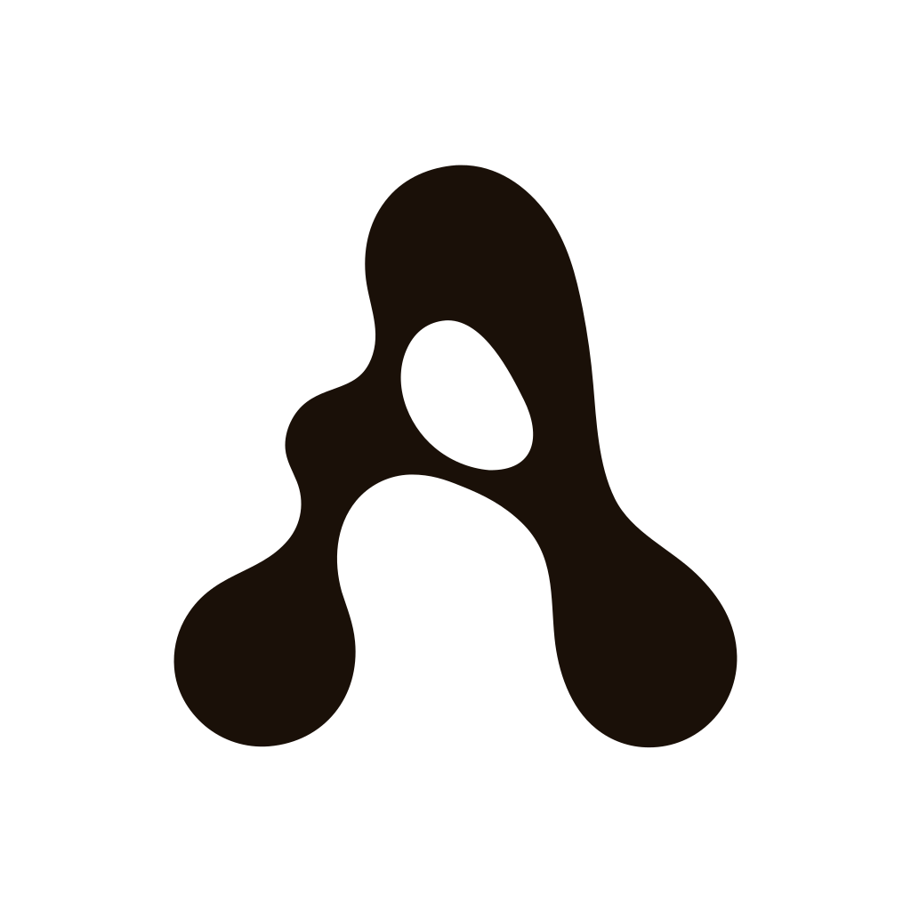

<div align="center">

<picture>
  <source media="(prefers-color-scheme: dark)" srcset="./assets/arche-mark-dark.svg">
  
</picture>

<h1>Arche</h1>

<p><strong>흩어진 문서를 관계 그래프로 바꿔, AI 에이전트가 적은 비용으로 정확한 답을 찾게 하는 지식 베이스 도구</strong></p>

<p>


</p>

</div>

---

회사의 정책과 계약서, 매뉴얼은 수백 개로 흩어져 있고, 어려운 질문일수록 답은 한 문서 안에 없어요. Arche 는 문서를 미리 점과 선의 관계 지도로 바꿔 두고, AI 에이전트가 그 위에서 작고 값싼 조회만으로 필요한 연결을 따라가게 해요.

답을 쓰는 건 Arche 가 아니에요. 그래프에서 사실 조각만 돌려주고 문장으로 엮는 일은 에이전트가 해요. 그래서 어떤 AI 모델을 쓰든 상관없어요.

## 설치

Claude Code 에서 두 줄이면 끝나요. 저장소를 받을 필요가 없어요.

```text
/plugin marketplace add Jungho-Cheon/arche
/plugin install arche@arche
```

[uv](https://docs.astral.sh/uv/) 가 미리 깔려 있어야 해요. 플러그인이 `uvx` 로 Arche 를 직접 받아 실행하거든요.

임베딩에 쓸 키를 한 번 넣어요. 문서에서 점과 선을 뽑는 일은 이미 쓰고 있는 Claude Code 구독 인증이 맡아서 추출용 키는 필요 없어요.

```bash
uvx --from "arche-api @ git+https://github.com/Jungho-Cheon/arche.git@v0.1.2#subdirectory=apps/api" \
  arche config set-key
```

## 해보기

같은 대화창에서 말로 시켜요.

```text
./docs 폴더를 Arche 에 넣어줘
환불 규정이 어떤 조건에서 적용돼?
```

적재는 무엇이 새로 생기고 무엇이 합쳐지는지 보여 준 뒤 확인을 받고서야 그래프에 써요. 그래프는 실행한 폴더 아래 `arche_kuzu_db` 에 쌓이고, 서버도 Docker 도 띄우지 않아요.

## 얼마나 정확한가

같은 모델과 같은 조건에서 잰 결과예요. 비교 대상 graphify 는 다른 그래프 기반 도구예요.

| 방식 | FinanceBench 33문항 |
| --- | --- |
| Arche 그래프 단독, 에이전트 반복 | **94-97%** |
| graphify 그래프 단독, 에이전트 반복 | 57.6% |
| Arche 그래프 단독, 단발 호출 | 45.5% |

정확도를 가른 건 모델 크기가 아니라 **추출 완전성**이었어요. 문서의 관계와 숫자를 얼마나 빠짐없이 그래프에 담았는지가 결정했어요. 근거는 [ADR-0016](./docs/adr/0016-agentic-graphonly-and-quantitative-extraction.md) 에 있어요.

절대 정답률은 도메인마다 달라요. 재무에서 97%, 생물의학에서 30% 였고, 일관되게 유지되는 건 순위예요. 무엇을 검증했고 무엇은 아직 안 쟀는지는 [왜 그래프인가](./apps/docs/about/why-graph.md) 의 "정직한 한계"에 적어 뒀어요.

## 무엇을 노출하나

에이전트가 부를 수 있는 도구는 12개예요. 그래프를 읽는 조회 7개와, 사람 확인을 거쳐 문서를 넣는 검토형 적재 5개.

| 조회 | 하는 일 |
|---|---|
| `get_schema` | 그래프에 어떤 종류의 점과 선이 있는지 |
| `find_entities` | 키워드로 출발점 찾기 (어휘 + 벡터 하이브리드) |
| `get_entity` | 점 하나의 상세와 인접 관계 수 |
| `get_neighbors` | 한 점의 N홉 이웃 펼치기 |
| `find_path` | 두 점을 잇는 경로 찾기 |
| `get_subgraph` | 여러 출발점 주변을 한꺼번에 펼치기 |
| `find_related` | 시드와 구조적으로 가까운 점 회수 |

노드를 만들거나 지우는 쓰기 도구는 노출하지 않아요. 그래프를 바꾸는 길은 검토형 적재뿐이에요.

같은 조회 7개가 REST 로도 열려 있어요. 두 통로가 코드의 한 스키마에서 나와서 서로 어긋나지 않아요.

## 다음에 볼 곳

| 보고 싶은 것 | 문서 |
|---|---|
| 설치부터 첫 질의까지 | [시작하기](./apps/docs/getting-started.md) |
| 무엇을 왜 만드는가 | [Arche 소개](./apps/docs/about/intro.md) |
| 도구별 요청/응답 필드 | [조회 도구 참조표](./apps/docs/query/tools.md) |
| 팀과 그래프 공유 | [팀과 그래프 공유하기](./apps/docs/operate/sharing.md) |
| 왜 이렇게 결정했나 | [ADR 인덱스](./docs/adr/README.md) |
| 코드 구조 (개발자용) | [ARCHITECTURE.md](./apps/api/ARCHITECTURE.md) |
| 지금 진행 상태 | [STATUS.md](./STATUS.md) |

문서 사이트는 `pnpm --dir apps/docs dev` 로 띄워요.

## 갈아끼울 수 있는 곳

특정 기술에 묶이지 않도록 세 군데를 열어 뒀어요 ([ADR-0018](./docs/adr/0018-monorepo-and-agnostic-boundaries.md)).

**부르는 쪽** — MCP 와 REST 두 표준 통로라 Claude 든 다른 모델이든 자체 에이전트든 붙어요.

**저장소** — 임베디드 Kuzu 와 Neo4j 를 설정 한 줄로 바꿔요. 혼자 쓸 때는 서버 없이 파일로, 팀이 공유할 때는 Neo4j 로 ([ADR-0023](./docs/adr/0023-embedded-default-shared-destination.md)).

**추출과 임베딩 모델** — 모델 이름의 접두사만 바꾸면 갈아끼워요. OpenAI 없이 Claude 와 Voyage 로도, Claude Code 구독 인증으로 추출용 키 없이도 돌아가요 ([ADR-0019](./docs/adr/0019-multi-provider-factory.md)).

## 관련 저장소

**`legacy-arche`** (별도 저장소) — 2026-06-15 PRD 재정립 이전의 작업이 보존돼 있어요. 이 저장소의 의사결정과는 무관해요.
