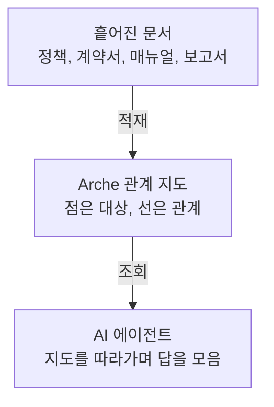

# Arche 소개

Arche 는 흩어진 문서를 서로 연결된 한 장의 지도로 바꿔 두는 도구예요. 그래서 AI 가 여러 문서에 걸쳐야 답이 나오는 질문에도 정확히 답하도록 도와요.

바로 손으로 해보려면 [시작하기](/getting-started)로 넘어가면 돼요.

## 누구를 위한 도구인가

Arche 는 열어서 바로 쓰는 완성된 앱이 아니에요. AI 프로그램이 뒤에서 불러다 쓰는 부품에 가까워요.

여기서 말하는 AI 프로그램을 흔히 **에이전트**라고 불러요. 사람이 시킨 질문 하나를 받으면 스스로 여러 번 되물어 가며 답을 좁혀 가는 자동화된 AI 예요. Claude Code 나 Claude Desktop 이 그런 프로그램이에요.

에이전트는 MCP 라는 표준 규약으로 Arche 에 연결해요. AI 에이전트가 외부 도구를 정해진 방식으로 부르게 해 주는 약속인데, 에이전트는 이 연결 하나로 문서를 그래프에 넣고 다시 그 그래프에 물어요. Arche 를 쓰는 기본 통로예요.

에이전트를 안 쓰고 직접 부르고 싶을 때를 위해 REST API 도 함께 열려 있어요.

## 어떤 문제를 푸나

회사의 정책과 계약서, 매뉴얼은 수백 개로 흩어져 있고, 어려운 질문일수록 답은 한 문서 안에 없어요. 여러 문서에 나뉜 사실을 이어 붙여야 나와요.

Arche 는 질문이 들어온 뒤에 문서를 뒤지는 대신, **미리 관계 지도를 만들어 둬요.** 사람과 회사, 규정 같은 대상을 점으로 찍고 그 사이 관계를 선으로 이어 둔 지도예요.

왜 이 방식이 더 정확한지와 실제 측정 결과는 [왜 그래프인가](/about/why-graph)에서 다뤄요.

## 무엇을 할 수 있나

세 가지 업무 장면이에요.

**고객센터.** 상담사가 "이번 여름 프로모션에 이 환불 규정이 그대로 적용되나요"라는 문의를 받아요. 답은 프로모션 공지 한 장에 없어요. 프로모션 조건과 환불 정책, 예외 조항이 서로 다른 문서에 흩어져 있어요. 지도가 있으면 AI 가 프로모션에서 환불 규정으로, 다시 예외 조항으로 선을 따라가며 답을 모아요.

**법무.** 계약서가 서로를 겹겹이 인용해요. A 계약이 B 부속 합의를 인용하고, 그 합의가 다시 기본 약관을 가리키는 식이에요. 어떤 조항이 어디에 걸려 있는지 사람이 일일이 따라가긴 고단해요. 관계 지도 위에서는 이 상호 참조를 선으로 훑어요.

**사내 온보딩.** "재택근무 규정이 부서마다 다른가요"에 답하려면 인사 규정과 부서 지침, 최근 공지를 한데 모아야 해요. 흩어진 규정을 지도로 엮어 두면 여러 문서에 걸친 답도 한 번에 끌어와요.

세 장면의 공통점은 하나예요. 답이 한 문서가 아니라 문서 사이의 연결에 있다는 것.

## 어떻게 생겼나

문서를 한 번 넣어 두면 Arche 가 점과 선의 지도로 바꿔요. 그다음부터 에이전트가 그 지도를 짧게 여러 번 짚어 가며 답을 완성해요.

**답을 쓰는 건 Arche 가 아니에요.** Arche 는 "이 노드는 이런 노드와 이렇게 이어져 있다" 같은 사실 조각만 돌려주고, 문장으로 엮는 일은 에이전트가 해요. 그래서 어떤 AI 모델을 쓰든 상관없어요.

## 시작하는 데 뭐가 필요한가

기본 배치는 서버도 Docker 도 필요 없어요. 그래프가 내 디스크의 폴더 하나에 들어가고, 설치하면 바로 돌아요.

필요한 건 파이썬 도구 하나와 임베딩용 API 키 하나예요. 문서에서 점과 선을 뽑는 일은 이미 쓰고 있는 Claude Code 구독 인증으로 대신할 수 있어요.

팀이 같은 그래프를 함께 보려면 그때 서버 배치로 옮겨요. 두 배치의 차이는 [저장소 배치](/operate/storage)에서 다뤄요.

## 지금 어디까지 왔나

Arche 는 초기 단계의 시제품이에요. 문서를 넣고 묻고 에이전트에 붙이는 흐름은 돌아가고 공개 평가셋으로 정확도도 쟀어요. 다만 다음 다섯 가지가 지금의 상태예요.

**직접 설치해 쓰는 부품이에요.** 켜서 바로 쓰는 완성 서비스가 아니고, 에이전트도 쓰는 쪽이 준비해요.

**자체 인증이 없어요.** 로그인이나 권한 계층이 없어서, 실제 환경에서는 앞단에 프록시나 사내 인증을 두는 걸 전제로 해요. [namespace](/operate/namespace) 는 데이터를 갈라 담지만 접근 통제는 아니에요.

**지우는 연산이 아직 없어요.** 넣은 문서나 노드를 골라 지우지 못해요. 되돌리려면 저장소를 통째로 비우고 다시 넣어요. 적재는 바뀐 부분만 갱신하는 것까지 해요.

**여러 namespace 를 한 번에 보는 질의가 없어요.** 한 호출은 하나의 namespace 만 봐요.

**특정 업체에 묶이지 않아요.** 그래프는 내 저장소에 남고, 추출과 임베딩 모델은 이름만 바꿔 갈아끼워요.

무엇을 검증했고 무엇은 아직 안 쟀는지는 [왜 그래프인가](/about/why-graph)의 "정직한 한계"에 있어요.

## 다음으로

- 손으로 해보려면 [시작하기](/getting-started)
- 원리가 궁금하면 [왜 그래프인가](/about/why-graph)
- 다른 도구와 어떻게 다른지는 [Arche 의 자리](/about/positioning)
- 처음 보는 용어가 있으면 [용어집](/reference/glossary)
