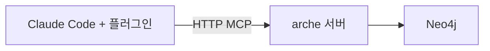

# 저장소 배치

Arche 는 그래프를 어디에 둘지 두 갈래로 나눠요. 혼자 쓰면 내 디스크의 폴더에, 여럿이 같이 보려면 별도 서버에 둬요.

바꾸는 방법은 [팀과 그래프 공유하기](/operate/sharing)에 있어요.

## 두 배치

**임베디드 (기본값).** 그래프가 내 디스크의 폴더 하나에 들어가요. Kuzu 라는 임베디드 데이터베이스를 쓰고, 서버 프로세스도 Docker 도 띄우지 않아요. 설치하고 바로 돌아요.

여기서 말하는 "서버"는 클라우드에 상주하는 게 아니라 대화 세션마다 뜨는 로컬 프로세스예요. 네트워크가 없고 저장소는 디스크의 폴더예요.

**공유 서버.** 여러 사람이 같은 그래프를 볼 때의 배치예요. Neo4j 를 띄우고, 에이전트의 요청은 그 앞의 Arche API 서버가 받아요.

## 무엇이 같고 무엇이 다른가

두 저장소는 **같은 기능을 노출해요.** 조회 도구 7개와 적재 도구 5개가 양쪽에서 똑같이 돌고, 벡터 검색과 키워드 검색도 둘 다 있어요. 도메인 코드는 어느 쪽이 붙었는지 몰라요.

다른 건 운영 성격이에요.

| | 임베디드 (Kuzu) | 공유 서버 (Neo4j) |
| --- | --- | --- |
| 서버 프로세스 | 없음 | Neo4j 와 API 서버 |
| Docker | 필요 없음 | 필요 |
| 동시 접근 | 한 사람 | 여러 사람 |
| 그래프 위치 | 내 디스크 폴더 | Neo4j 데이터 볼륨 |
| 시작 비용 | 설치 즉시 | 컨테이너 기동과 설정 |

## 언제 옮기나

임베디드로 시작하고, 아래 중 하나가 생기면 옮겨요.

- 팀원이 같은 그래프를 봐야 해요.
- 여러 사람이 동시에 적재하거나 조회해요.
- 그래프를 개인 노트북이 아닌 곳에 두어야 해요.

혼자 쓰는 동안에는 옮길 이유가 없어요. 임베디드가 느려서 서버로 가는 게 아니라, 여럿이 봐야 해서 가요.

## 옮길 때 그래프는 따라가지 않아요

`ARCHE_API_GRAPH_BACKEND` 를 바꾸면 **다른 저장소를 보게 될 뿐, 기존 그래프가 옮겨지지는 않아요.** Kuzu 폴더에 쌓아 둔 내용은 Neo4j 로 넘어가지 않아요.

옮긴 뒤에는 문서를 다시 적재해야 해요. 저장소끼리 내보내고 들여오는 명령은 아직 없어요.

## 옮겨도 안 바뀌는 것

배치를 바꿔도 세 가지는 그대로예요.

- **도구 이름과 입출력.** 에이전트 쪽 코드는 손댈 게 없어요.
- **`namespace_id` 로 가른 범위.** 어느 저장소든 같은 방식으로 격리해요.
- **MCP 전송 선택.** stdio 와 HTTP 둘 다 열려 있어요.

바뀌는 건 설정 두 줄, 그러니까 저장소 백엔드 값과 MCP 클라이언트가 stdio 를 띄울지 HTTP 주소를 볼지예요.

## 아직 없는 것

공유 서버 배치에는 인증과 권한 계층이 없어요. `Authorization: Bearer ns:<이름>` 은 어느 namespace 를 볼지 고르는 값이지 로그인이 아니고, 토큰을 검증하지도 않아요. 관리 엔드포인트도 열려 있어요.

그래서 사내에 두려면 앞단에 프록시나 사내 인증을 세우는 걸 전제로 해요. 자세한 경계는 [namespace 로 나눠 담기](/operate/namespace)에 있어요.

## 다음으로

- 실제로 옮기려면 [팀과 그래프 공유하기](/operate/sharing)
- 설정 값은 [환경 변수](/reference/configuration)
